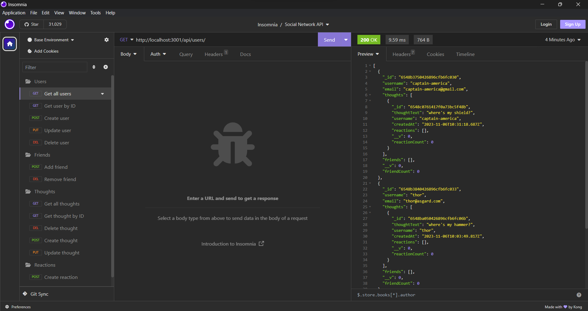

# Text-Editor

## Description

This is an API for a social network web application where users can share their thoughts, react to friends’ thoughts, and create a friend list.

Watch the demo video: https://www.youtube.com/watch?v=tnyTKjetvtM

A screenshot of the application running:

## Table of Contents

- [Installation](#installation)
- [Usage](#usage)
- [Credits](#credits)
- [License](#license)
- [Contributions](#contributions)
- [Tests](#Tests)
- [Questions](#Questions)

## Installation

Clone this repository. Run `npm install` to install dependencies.

## Usage

Run `npm run start`.

Open Insomnia. Download and import the [HTTP requests](./assets/Insomnia_2023-11-06.json).

Run the requests.

## Credits

- Express
  - https://www.npmjs.com/package/express
- Mongoose
  - https://www.npmjs.com/package/mongoose
- UCI BCS for template code and the application description.
- AskBCS for help with debugging.

## License

This project uses the MIT License.

https://opensource.org/licenses/MIT 

## Contributions

N/A

## Tests

N/A

## Questions

If you have any questions about the project, please reach out!

Github: https://github.com/danhalsim

Email: dansim6935@gmail.com